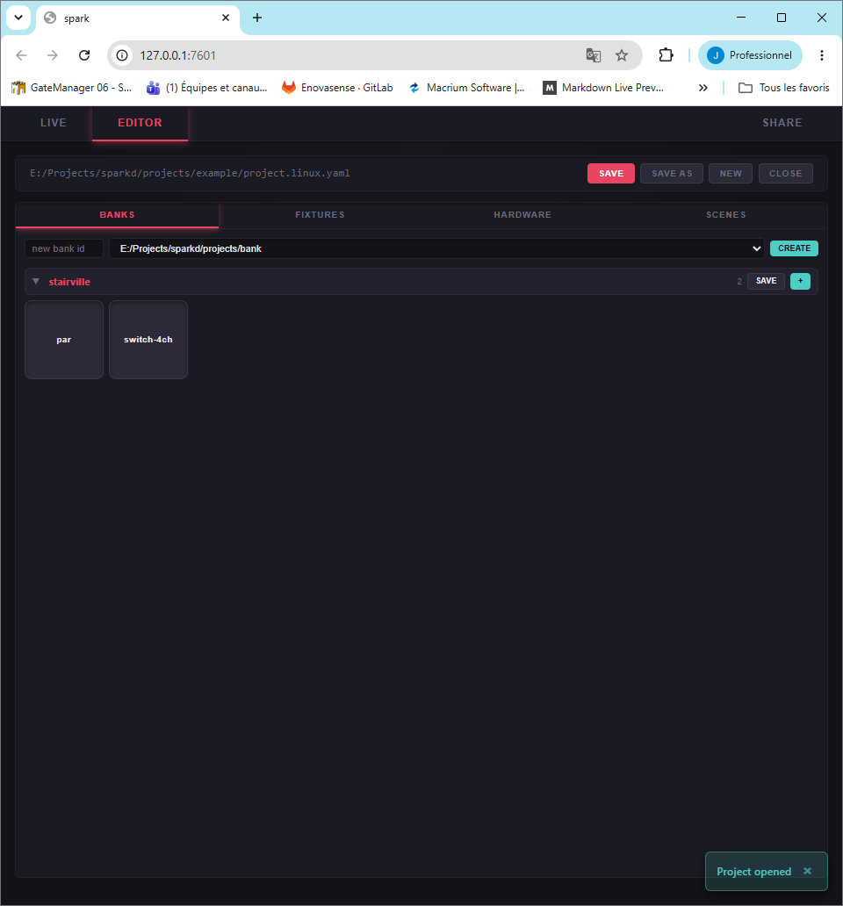

# Project Setup

This guide walks you through creating a project from scratch using the web UI.

## Opening / Creating a Project

1. Launch sparkd and open the UI (see [Getting Started](getting-started.md))
2. Switch to the **EDITOR** tab
3. Click **NEW** to create a blank project, or open an existing `.spark.yaml` file

The file browser lets you navigate to any location on your system:

Once opened, you'll see the project path in the toolbar:

## Step 1: Fixture Banks

Before adding fixtures, check that your fixture banks are loaded. The **BANKS** tab shows available template libraries:

Banks provide reusable fixture definitions (channel layouts) so you don't have to define channels manually every time. sparkd loads banks from:

- `~/.spark/fixtures/` (default)
- Directories listed in `SPARK_FIXTURE_BANK_PATH`

If you don't have banks yet, you can still add fixtures manually (see below).

## Step 2: Add Fixtures

Switch to the **FIXTURES** tab and click **+ ADD**:

You have three options:

### From a template (recommended)

Select a bank and fixture template. The channel layout is filled automatically:

You only need to provide:
- **ID** — unique identifier (e.g. `par-left`)
- **Start address** — DMX address where this fixture begins (1-512)

### Manual

Define each channel by hand:

Provide:
- **ID** and **Start address**
- **Channel count** — how many DMX channels this fixture uses
- **Channels** — name and offset for each channel

### Copy from existing

Duplicate the channel layout from a fixture already in your project:

Useful when you have multiple identical lights at different addresses.

## Step 3: Configure Hardware

Switch to the **HARDWARE** tab to set up your MIDI and DMX devices:

### MIDI

- **Device** — the name (or part of the name) of your MIDI controller. sparkd does a substring match, so `"KeyStep"` matches `"Arturia KeyStep 32"`. Leave empty to disable MIDI input.
- **Mode**:
  - `open-existing` — connect to a physical/virtual MIDI port already on the system
  - `create-virtual` — create a new virtual MIDI port (useful for routing from a DAW)

> **Tip:** Use `spark-midi list` in a terminal to see available MIDI devices.

### DMX

- **Device** — serial port path. On Windows this is a COM port (e.g. `COM3`), on Linux a `/dev/tty` path (e.g. `/dev/ttyUSB0`). Leave empty to use the dummy backend.
- **Backend**:
  - `open` — Open DMX protocol (break + raw frames). Works with most USB-DMX interfaces.
  - `pro` — Enttec Pro protocol (packetized serial). For Enttec Pro and compatible interfaces.
  - `dummy` — No DMX output. Useful for testing without hardware.
- **Refresh Hz** — DMX update rate (1-44 Hz, default 25). Higher = more responsive, but some fixtures struggle above 30 Hz.

> **Not sure which backend?** Try both `open` and `pro` — only the correct one will work with your interface.

## Step 4: Create Scenes

Switch to the **SCENES** tab and click **+ ADD SCENE**:

### Static Scene

A static scene applies fixed DMX values while active:

Configure:
- **ID** — unique identifier (e.g. `red-wash`)
- **Name** — display name (shown on the Live pad)
- **Trigger** — MIDI channel (1-16), note (0-127), and mode:
  - `gate` — active while the key is held
  - `toggle` — press to activate, press again to release
- **Values** — set DMX values for each fixture channel (0-255)

### Sequence Scene

A sequence scene cycles through timed steps:

Configure:
- Same trigger settings as static
- **Loop** — whether the sequence repeats
- **Steps** — each step has:
  - Duration (milliseconds)
  - Transition: `snap` (instant) or `linear` (smooth crossfade)
  - Values for that step

## Step 5: Save

Click **SAVE** in the toolbar to write your project to disk. The file is a `.spark.yaml` that you can also edit by hand (see [Project File Format](project-format.md)).

Use **SAVE AS** to save a copy to a different location.

An indicator appears when you have unsaved changes:

## Step 6: Go Live

1. Switch to the **LIVE** tab
2. Click **Start** to activate the engine
3. Your scenes appear as pads — click them or trigger via MIDI

See [Web UI Guide](ui-guide.md) for more on the Live view.

## Error Handling

If your project file has issues, sparkd shows a detailed error with the file path and line number:

Fix the issue in the Editor and save again, or edit the YAML file directly and use **Reload**.

## Next Steps

- [Web UI Guide](ui-guide.md) — Deep dive into the UI features
- [Configuration](configuration.md) — Set up fixture banks and project roots
- [Project File Format](project-format.md) — Hand-edit YAML like a pro
