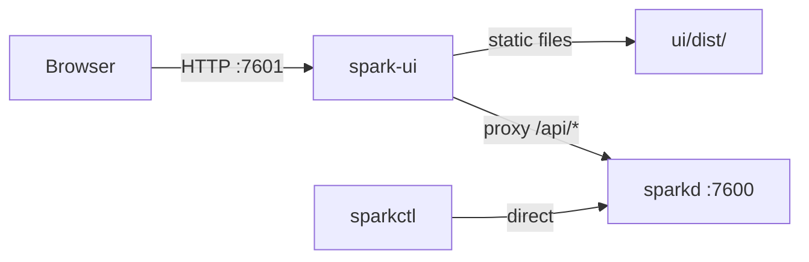

# spark-ui Executable

## Architecture

`spark-ui` is a standalone C process, separate from `sparkd`. It:
- Serves the built Svelte static files (HTML/JS/CSS)
- Proxies `/api/*` requests to the sparkd HTTP API
- Maintains its own WebSocket connection to sparkd (future) for live state push to browsers

This isolation ensures the UI can never interfere with the show-critical engine loop.



## Key Decisions

- **Separate binary**: `spark-ui` in `daemon/tools/spark_ui.c`, built with Mongoose only (no portmidi, no libyaml)
- **Own port**: Defaults to `http://127.0.0.1:7601` (one above sparkd)
- **Static serving**: Serves files from a `--ui-root` directory (default: `../ui/dist` relative to binary, or `./ui/dist`)
- **API proxy**: All `/api/*` and future `/ws` requests are forwarded to sparkd's address
- **SPA fallback**: Any non-file, non-API route serves `index.html`
- **CLI args**: `--http ADDR` (listen), `--daemon ADDR` (sparkd target), `--ui-root PATH`
- **Env vars**: `SPARK_UI_HTTP_ADDR`, `SPARK_UI_DAEMON_ADDR`

## Svelte UI (initial scaffold)

- `ui/` directory at project root with Vite + Svelte + TypeScript
- Initial "Live" page only:
  - Status bar (running, blackout, project path)
  - Scene pad: buttons from scene defs via `GET /api/scenes`
  - Manual activate/deactivate via `POST /api/scenes/{id}/activate` and `POST /api/scenes/{id}/release`
  - Blackout / Clear Blackout buttons
- Dark theme, touch-friendly large buttons
- `npm run build` outputs to `ui/dist/`

## sparkd API additions needed

Before the UI is functional, sparkd needs a couple more endpoints:
- `GET /api/scenes` -- returns scene defs (id, name, trigger mode, type)
- `POST /api/scenes/{id}/activate` -- manually activate a scene
- `POST /api/scenes/{id}/release` -- manually release a scene

These inject scenes without MIDI (manual control from the pad).

## File Layout

```
ui/                         # Svelte project (npm)
  package.json
  vite.config.ts
  src/
    App.svelte
    lib/api.ts              # fetch wrapper
    routes/Live.svelte      # scene pad + status
  dist/                     # build output (served by spark-ui)

daemon/tools/spark_ui.c     # C static server + proxy
```

## Build Integration

- Add `spark-ui` to `daemon/Makefile` `STANDALONE_TOOLS`
- Link only against Mongoose (like sparkctl)
- Add a top-level `make ui` target that runs `cd ui && npm run build`

## CLI

```
spark-ui [--http ADDR] [--daemon ADDR] [--ui-root PATH]

  --http ADDR      Listen address (default: http://127.0.0.1:7601)
  --daemon ADDR    sparkd address to proxy to (default: http://127.0.0.1:7600)
  --ui-root PATH   Directory containing built UI files (default: ui/dist)
```

## Implementation Steps

1. Add `GET /api/scenes`, `POST /api/scenes/{id}/activate`, `POST /api/scenes/{id}/release` to sparkd
2. Create `daemon/tools/spark_ui.c`: static file server + API reverse proxy using Mongoose
3. Add spark-ui build rule to Makefile (mongoose-only, like sparkctl)
4. Scaffold `ui/` with Vite + Svelte + TypeScript, dark theme, Live page with scene pad
5. Implement `api.ts` fetch wrapper and `Live.svelte` with status + pad buttons
6. Add top-level `make ui` target that builds the Svelte app into `ui/dist`
