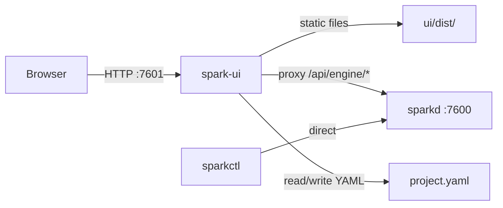

# spark-ui Executable

## Architecture

`spark-ui` is a standalone C process, separate from `sparkd`. It:
- Serves the built Svelte static files (HTML/JS/CSS)
- Proxies `/api/*` requests to the sparkd HTTP API for runtime control
- Owns the project editor: loads, saves, and validates YAML project files directly
- Maintains its own WebSocket connection to sparkd (future) for live state push to browsers

This isolation ensures the UI can never interfere with the show-critical engine loop.



## Two Pages

- **Runtime** (Live): Engine status, scene pad, blackout controls. Reads state from sparkd, sends activate/release commands.
- **Editor**: Create/edit fixtures and scenes. Reads and writes the project YAML directly (spark-ui owns this, not sparkd). After saving, can trigger a `reload` on sparkd.

## Key Decisions

- **Separate binary**: `spark-ui` in `daemon/tools/spark_ui.c`, built with Mongoose + libyaml (no portmidi)
- **Own port**: Defaults to `http://127.0.0.1:7601` (one above sparkd)
- **Static serving**: Serves files from a `--ui-root` directory (default: `ui/dist`)
- **API proxy**: `/api/engine/*` and `/api/scenes/*` runtime requests forwarded to sparkd
- **Editor API**: `/api/editor/*` handled locally by spark-ui (CRUD on YAML)
- **SPA fallback**: Any non-file, non-API route serves `index.html`
- **CLI args**: `--http ADDR` (listen), `--daemon ADDR` (sparkd target), `--ui-root PATH`, `--project PATH`
- **Env vars**: `SPARK_UI_HTTP_ADDR`, `SPARK_UI_DAEMON_ADDR`, `SPARK_PROJECT_PATH`

## State Ownership

- The **in-memory project** lives in the spark-ui C process (not in the browser).
- The browser is a stateless view — it fetches state from spark-ui on each page load.
- If spark-ui restarts, unsaved edits are lost (standard editor behavior: save before quitting).
- One spark-ui instance per port. Multiple instances on different ports are independent sessions.
- Restarting spark-ui on the same port with `--project` resumes where you left off (re-reads from disk).

## spark-ui Editor API

These endpoints are served by spark-ui itself (not proxied).

### Project lifecycle

```
POST /api/editor/open             Open a project: {path: "..."}
POST /api/editor/close            Close current project, unload everything
POST /api/editor/save             Save to current path (in current format)
POST /api/editor/save-as          Save to new path: {path: "...", format: "single|directory"}
GET  /api/editor/project          Get current project state: {path, format, fixtures, scenes, midi, dmx}
```

- **Open**: Parses the YAML at `path`, becomes the active project. Updates spark-ui's internal project path.
- **Close**: Discards in-memory project state. No project is loaded. The UI shows an empty/welcome state.
- **Save**: Writes to the current path in the current format (single file or directory).
- **Save As**: Writes to a new path. The new path becomes the current project path. Format can be `"single"` (one `.spark.yaml` file) or `"directory"` (manifest `project.yaml` + separate `fixtures.yaml` / `scenes.yaml`).
- **Start without project**: spark-ui starts with no project loaded. The user must open or create one.

The editor only saves to disk. Reloading sparkd (stop, reload, start) is done explicitly from the runtime page.

### Fixture and scene CRUD (operates on in-memory project)

```
GET  /api/editor/fixtures         List fixtures
POST /api/editor/fixtures         Add a fixture
PUT  /api/editor/fixtures/{id}    Update a fixture
DELETE /api/editor/fixtures/{id}  Remove a fixture

GET  /api/editor/scenes           List scenes
POST /api/editor/scenes           Add a scene
PUT  /api/editor/scenes/{id}      Update a scene
DELETE /api/editor/scenes/{id}    Remove a scene
```

CRUD edits the in-memory state only. Nothing touches disk until an explicit save.

## sparkd API additions needed

For the runtime page, sparkd needs:
- `GET /api/scenes` -- returns scene defs (id, name, trigger mode, type)
- `POST /api/scenes/{id}/activate` -- manually activate a scene
- `POST /api/scenes/{id}/release` -- manually release a scene

## Svelte UI

- `ui/` directory at project root with Vite + Svelte + TypeScript
- Two pages:
  - **Live**: Status bar (running, blackout, project), scene pad (buttons from defs), blackout/clear buttons
  - **Editor**: Fixture list + form, scene list + form, save button triggering YAML write + daemon reload
- Dark theme, touch-friendly large buttons
- `npm run build` outputs to `ui/dist/`

## File Layout

```
ui/                         # Svelte project (npm)
  package.json
  vite.config.ts
  src/
    App.svelte
    lib/api.ts              # fetch wrapper
    pages/Live.svelte       # runtime: scene pad + status
    pages/Editor.svelte     # editor: fixtures + scenes CRUD
  dist/                     # build output (served by spark-ui)

daemon/tools/spark_ui.c     # C static server + proxy + editor API
```

## Build Integration

- Add `spark-ui` to `daemon/Makefile` `STANDALONE_TOOLS`
- Link against Mongoose + libyaml (no portmidi)
- Add a top-level `make ui` target that runs `cd ui && npm run build`

## CLI

```
spark-ui [--http ADDR] [--daemon ADDR] [--ui-root PATH] [--project PATH] [--open-browser]

  --http ADDR      Listen address (default: http://127.0.0.1:7601)
  --daemon ADDR    sparkd address to proxy to (default: http://127.0.0.1:7600)
  --ui-root PATH   Directory containing built UI files (default: ui/dist)
  --project PATH   Open this project on startup (optional, default: none)
  --open-browser   Open the default browser on startup
```

If `--project` is omitted and `SPARK_PROJECT_PATH` is not set, spark-ui starts with no project loaded. The user opens one from the UI.

Closing the browser does not stop spark-ui. The process runs until killed (Ctrl+C, signal, or system shutdown). This is intentional — reopening the browser reconnects to the same session.

## Implementation Steps

1. Add `GET /api/scenes`, `POST /api/scenes/{id}/activate`, `POST /api/scenes/{id}/release` to sparkd
2. Create `daemon/tools/spark_ui.c`: static file server + API proxy + editor endpoints (Mongoose + libyaml)
3. Add spark-ui build rule to Makefile
4. Scaffold `ui/` with Vite + Svelte + TypeScript, dark theme
5. Implement Live page: status + scene pad with activate/release
6. Implement Editor page: fixture and scene CRUD forms, save to YAML, trigger reload
7. Add top-level `make ui` target
